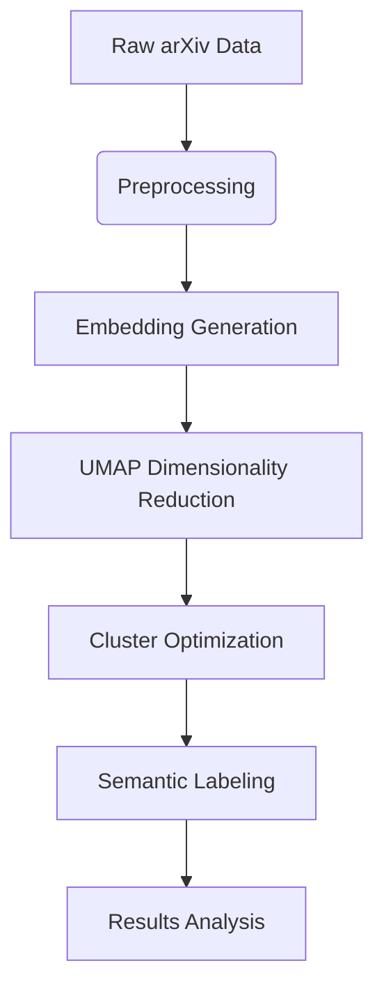

# ✨ Advanced NLP Clustering for Academic Papers

This project implements a modern NLP pipeline for clustering academic papers using state-of-the-art techniques:

* 🧠 **Sentence Transformers** for semantic embeddings
* 📉 **UMAP** for dimensionality reduction
* 🧩 **Agglomerative Clustering** with stability validation
* 🏷️ **Hybrid Labeling** combining **KeyBERT** and **Groq's LLM (Llama 3)**

---

## 🚀 Features

✅ **Domain-Specific Enhancement**
Technical term highlighting and abbreviation expansion

✅ **Optimal Cluster Detection**
Combined silhouette score and stability metrics

✅ **Advanced Labeling**
Hybrid KeyBERT + LLM approach with robust output cleaning

✅ **Efficient Processing**
Batch embedding generation and UMAP dimensionality reduction

✅ **Reproducible Research**
Full configuration management for consistent results

---

## 🛠️ Installation

1️⃣ **Clone the repository**

```bash
git clone https://github.com/YOUR_USERNAME/nlp-clustering.git
cd nlp-clustering
```

2️⃣ **Install dependencies**

```bash
pip install -r requirements.txt
```

3️⃣ **Set up environment variables**

```bash
echo "GROQ_API_KEY=your_api_key_here" > .env
```

---

## 📈 Usage

### 1️⃣ Download Data

* Download the [arXiv dataset](https://www.kaggle.com/datasets/Cornell-University/arxiv/data)
* Place `arxiv-metadata-oai-snapshot.json` in the same directory as your Python files

---

### 2️⃣ Preprocess Data

```bash
python preprocess_arxiv.py
```

---

### 3️⃣ Run Clustering Pipeline

```bash
python arxiv_clustering.py
```

---

## 🧬 Workflow Overview



---

## 📊 Analyze Results (Example)

You can quickly analyze and visualize cluster distributions:

```python
import pandas as pd
import matplotlib.pyplot as plt

df = pd.read_csv("clustered_arxiv.csv")

print(f"Total papers: {len(df)}")
print("Cluster distribution:\n", df["cluster"].value_counts())

df["cluster_label"].value_counts().plot.barh()
plt.title("Paper Distribution by Topic Cluster")
plt.tight_layout()
plt.savefig("cluster_distribution.png")
```

---

## 🌟 License

This project is licensed under the MIT License.

---

## 💬 Questions?

Feel free to open an issue or reach out!

